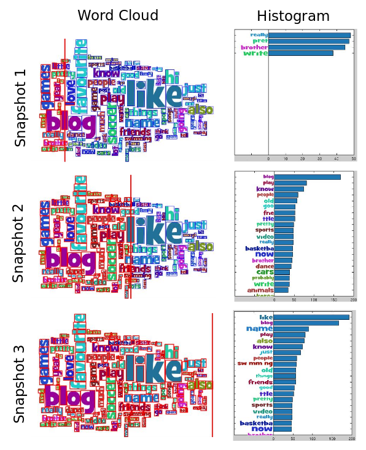

Decoding the Text Encoding
===============
## Team Members

1. Hamid Izadinia izadinia@uw.edu
2. Fereshteh Sadeghi fsadeghi@uw.edu

## Overview

## Commentary on research/development process
In this project we want to extract the raw data information in a given word cloud image.
Word clouds and text visualization is one of the recent most popular and widely used types of visualizations. Despite the attractiveness and simplicity of producing word clouds, they do not provide a thorough visualization for the distribution of the underlying data. Therefore, it is important to redesign word clouds for improving their design choices and to be able to do further statistical analysis on data. In this paper we have proposed the development of a fully automatic redesigning algorithm for word cloud visualization. Our proposed method is able to decode an input word cloud visualization and provides the raw data in the form of a list of (word, value) pairs. To the best of our knowledge our work is the first attempt to extract raw data from word cloud visualization. We have tested our proposed method both qualitatively and quantitatively. The results of our experiments show that our algorithm is able to extract the words and their weights effectively with considerable low error rate. 

## Work Breakdown
The workload of the project is divided in every step. The details are as follows:

- Discussion about the algorithm and ideas used in every step and the possible evaluation methods. (Fereshteh Sadeghi, Hamid Izadinia)

- Applying computer vision methods for extraction of the connected regions in the image. (Hamid Izadinia)

- Implementation of finding connected components in graph using bipartite graph matching algorithm. (Fereshteh Sadeghi)

- Recognizing the corresponding letter for each image patch using an OCR method which is based on cross correlation between image patch and templates. (Fereshteh Sadeghi)

- Qualitative evaluation using downloaded images from Google. (Hamid Izadinia)

- Quantitative evaluation using word cloud implementation of d3 for generating word cloud and extraction of the ground truth values from SVG files. Then, processing PNG files using our method and compare the output results with the ground truth. (Hamid Izadinia)

[Poster](https://github.com/CSE512-14W/fp-izadinia-fsadeghi/raw/master/final/poster-izadinia-fsadeghi.pdf),
[Final Paper](https://github.com/CSE512-14W/fp-izadinia-fsadeghi/raw/master/final/paper-izadinia-fsadeghi.pdf) 

## Running Instructions
This project is implemented in Matlab and C++. For running the code you can run "run_script". In this script the following functions will run and the results will show in figure in every iteration of algorithm. The error of value estimation compared to ground truth prints as output.

The functions are:

1. Extracting the connected components in the image
    
     connected_comp_patch.m
     
2. Computing the edge weights for all connections in graph
     
     get_rel_letters_func.m
     get_rel_letters_vert_func.m

3. Iterative word extraction and their weight estimation
    
    convert_image_to_chart.m

4. Reading ground truth histograms from SVG file
    
    read_gt.m

